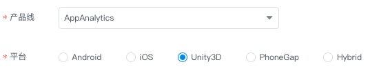

## TalkingData AppAnalytics Unity SDK
App Analytics Unity 平台 SDK 由`封装层`和 `Native SDK` 两部分构成，目前GitHub上提供了封装层代码，需要从 [TalkingData官网](https://www.talkingdata.com/spa/sdk/#/config) 下载最新版的 Android 和 iOS 平台 Native SDK，组合使用。

### 集成说明
1. 下载本项目（封装层）到本地；  
2. 访问 [TalkingData官网](https://www.talkingdata.com/spa/sdk/#/config) 下载最新版的 Android 和 iOS 平台 App Analytics SDK（ Native SDK）
	- 方法1：选择 Unity 平台进行功能定制；
	- 方法2：分别选择 Android 和 iOS 平台进行功能定制，但请确保两个平台功能项一致；  
	
3. 将下载的最新版 `Native SDK` 复制到`封装层`中，构成完整的 Unity SDK。  
	- Android 平台  
	将最新的 .jar 文件复制到 `Assets/Plugins/Android` 目录下
	- iOS 平台  
	将最新的 .a 文件复制到 `Assets/Plugins/iOS` 目录下
4. 按 `Native SDK` 功能选项对`封装层`代码进行必要的删减，详见“注意事项”第2条；
5. 将 Unity SDK 集成您需要统计的工程中，并按 [集成文档](http://doc.talkingdata.com/posts/34) 进行必要配置和功能调用。

### 注意事项
1. 确保 Android 和 iOS Native SDK 功能项一致。
2. 如果申请 Android 和 iOS SDK 时只选择部分功能，则需要在本项目中删除未选择功能对应的封装层代码。  
	a) 未选择`自定义事件`功能则删除以下3部分  
	删除 `Assets/TalkingDataScripts/TalkingDataPlugin.cs` 文件中如下代码：
	
	```
		[DllImport ("__Internal")]
		private static extern void tdTrackEvent(string eventId);
		
		[DllImport ("__Internal")]
		private static extern void tdTrackEventLabel(string eventId, string eventLabel);
		
		[DllImport ("__Internal")]
		private static extern void tdTrackEventParameters(string eventId, string eventLabel, 
				string[] keys, string[] stringValues, double[] numberValues, int count);
	```
	```
		public static void TrackEvent(string eventId)
		{
			...
		}
		
		public static void TrackEventWithLabel(string eventId, string eventLabel)
		{
			...
		}
		
		public static void TrackEventWithParameters(string eventId, string eventLabel, 
				Dictionary<string, object> parameters)
		{
			...
		}
	```
	删除 `Assets/Plugins/iOS/TalkingData.mm` 文件中如下代码：
	
	```
		void tdTrackEvent(const char *eventId) {
			...
		}
		
		void tdTrackEventLabel(const char *eventId, const char *eventLabel) {
			...
		}
		
		void tdTrackEventParameters(const char *eventId, const char *eventLabel,
				const char *keys[], const char *stringValues[],
				double numberValues[], int count) {
			...
		}
	```
	删除 `Assets/Plugins/iOS/TalkingData.h` 文件中如下代码：
	
	```
	+ (void)trackEvent:(NSString *)eventId;
	+ (void)trackEvent:(NSString *)eventId label:(NSString *)eventLabel;
	+ (void)trackEvent:(NSString *)eventId 
				 label:(NSString *)eventLabel 
			parameters:(NSDictionary *)parameters;
	+ (void)setGlobalKV:(NSString *)key value:(id)value;
	+ (void)removeGlobalKV:(NSString *)key;
	```
	b) 未选择`标准化事件分析`功能则删除以下5部分  
	删除 `Assets/TalkingDataScripts/TalkingDataOrder.cs` 文件  
	删除 `Assets/TalkingDataScripts/TalkingDataShoppingCart.cs` 文件  
	删除 `Assets/TalkingDataScripts/TalkingDataPlugin.cs` 文件中如下代码：
	
	```
		[DllImport ("__Internal")]
		private static extern void tdOnPlaceOrder(string account, string orderJson);
		
		[DllImport ("__Internal")]
		private static extern void tdOnOrderPaySucc(string account, string payType, string orderJson);
		
		[DllImport ("__Internal")]
		private static extern void tdOnViewItem(string itemId, string category, string name, int unitPrice);
		
		[DllImport ("__Internal")]
		private static extern void tdOnAddItemToShoppingCart(string item, string category, string name, int unitPrice, int amount);
		
		[DllImport ("__Internal")]
		private static extern void tdOnViewShoppingCart(string shoppingCartJson);
	```
	```
		public static void OnPlaceOrder(string accountId, TalkingDataOrder order)
		{
			...
		}
		
		public static void OnOrderPaySucc(string accountId, string payType, TalkingDataOrder order)
		{
			...
		}
		
		public static void OnViewItem(string itemId, string category, string name, int unitPrice)
		{
			...
		}
		
		public static void OnAddItemToShoppingCart(string itemId, string category, string name, int unitPrice, int amount)
		{
			...
		}
		
		public static void OnViewShoppingCart(TalkingDataShoppingCart shoppingCart)
		{
			...
		}
	```
	删除 `Assets/Plugins/iOS/TalkingData.mm` 文件中如下代码：
	
	```
		void tdOnPlaceOrder(const char *accountId, const char *orderJson) {
			...
		}
		
		void tdOnOrderPaySucc(const char *accountId, const char *payType, const char *orderJson) {
			...
		}
		
		void tdOnViewItem(const char *itemId, const char *category, const char *name, int unitPrice) {
			...
		}
		
		void tdOnAddItemToShoppingCart(const char *itemId, const char *category, const char *name, int unitPrice, int amount) {
			...
		}
		
		void tdOnViewShoppingCart(const char *shoppingCartJson) {
			...
		}
	```
	删除 `Assets/Plugins/iOS/TalkingData.h` 文件中如下代码：
	
	```
	@interface TalkingDataOrder : NSObject
	+ (TalkingDataOrder *)createOrder:(NSString *)orderId total:(int)total currencyType:(NSString *)currencyType;
	- (TalkingDataOrder *)addItem:(NSString *)itemId category:(NSString *)category name:(NSString *)name unitPrice:(int)unitPrice amount:(int)amount;
	@end
	
	@interface TalkingDataShoppingCart : NSObject
	+ (TalkingDataShoppingCart *)createShoppingCart;
	- (TalkingDataShoppingCart *)addItem:(NSString *)itemId category:(NSString *)category name:(NSString *)name unitPrice:(int)unitPrice amount:(int)amount;
	@end
	```
	```
	+ (void)onPlaceOrder:(NSString *)account order:(TalkingDataOrder *)order;
	+ (void)onOrderPaySucc:(NSString *)account payType:(NSString *)payType order:(TalkingDataOrder *)order;
	+ (void)onViewItem:(NSString *)itemId category:(NSString *)category name:(NSString *)name unitPrice:(int)unitPrice;
	+ (void)onAddItemToShoppingCart:(NSString *)itemId category:(NSString *)category name:(NSString *)name unitPrice:(int)unitPrice amount:(int)amount;
	+ (void)onViewShoppingCart:(TalkingDataShoppingCart *)shoppingCart;
	```
	c) 未选择`页面统计`功能则删除以下3部分  
	删除 `Assets/TalkingDataScripts/TalkingDataPlugin.cs` 文件中如下代码：
	
	```
		[DllImport ("__Internal")]
		private static extern void tdTrackPageBegin(string pageName);
		
		[DllImport ("__Internal")]
		private static extern void tdTrackPageEnd(string pageName);
	```
	```
		public static void TrackPageBegin(string pageName)
		{
			...
		}
		
		public static void TrackPageEnd(string pageName)
		{
			...
		}
	```
	删除 `Assets/Plugins/iOS/TalkingData.mm` 文件中如下代码：
	
	```
		void tdTrackPageBegin(const char *pageName) {
			...
		}
		
		void tdTrackPageEnd(const char *pageName) {
			...
		}
	```
	删除 `Assets/Plugins/iOS/TalkingData.h` 文件中如下代码：
	
	```
	+ (void)trackPageBegin:(NSString *)pageName;
	+ (void)trackPageEnd:(NSString *)pageName;
	```
	d) 未选择`灵动分析`功能无需删除封装层代码  
	e) 未选择`用户质量评估`功能则删除以下3部分  
	删除 `Assets/TalkingDataScripts/TalkingDataPlugin.cs` 文件中如下代码：
	
	```
		[DllImport ("__Internal")]
		private static extern void tdSetAntiCheatingEnabled(bool enable);
	```
	```
		public static void SetAntiCheatingEnabled(bool enable)
		{
			...
		}
	```
	删除 `Assets/Plugins/iOS/TalkingData.mm` 文件中如下代码：
	
	```
		void tdSetAntiCheatingEnabled(bool enable) {
			...
		}
	```
	删除 `Assets/Plugins/iOS/TalkingData.h` 文件中如下代码：
	
	```
		+ (void)setAntiCheatingEnabled:(BOOL)enabled;
	```
	f) 未选择`推送营销`功能则删除以下３部分  
	删除 `Assets/TalkingDataScripts/TalkingDataPlugin.cs` 文件中如下代码：
	
	```
		[DllImport ("__Internal")]
		private static extern void tdSetDeviceToken(string deviceToken);
		
		[DllImport ("__Internal")]
		private static extern void tdHandlePushMessage(string message);
	```
	```
	#if UNITY_IPHONE
	#if UNITY_5
		public static void SetDeviceToken() {
			...
		}
		
		public static void HandlePushMessage() {
			...
		}
	#else
		public static void SetDeviceToken() {
			...
		}
		
		public static void HandlePushMessage() {
			...
		}
	#endif
	#endif
	```
	删除 `Assets/Plugins/iOS/TalkingData.mm` 文件中如下代码：

	```
		void tdSetDeviceToken(const char *deviceToken) {
			...
		}
		
		void tdHandlePushMessage(const char *message) {
			...
		}
	```
	删除 `Assets/Plugins/iOS/TalkingData.h` 文件中如下代码：

	```
	+ (void)setDeviceToken:(NSData *)deviceToken;
	+ (BOOL)handlePushMessage:(NSDictionary *)message;
	```
	g) 未选择`易认证`功能则删除以下4部分  
	删除 `Assets/TalkingDataScripts/TalkingDataSMSPlugin.cs` 文件  
	删除 `Assets/Plugins/Android/TalkingDataSMSPlugin.jar` 文件  
	删除 `Assets/Plugins/iOS/TalkingDataSMS.mm` 文件  
	删除 `Assets/Plugins/iOS/TalkingDataSMS.h` 文件  
	
